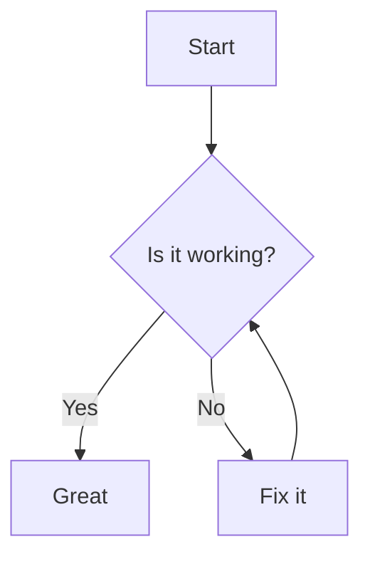

# Markdown → PDF (React + TypeScript + Vite)

A fast, client‑side web app that converts Markdown to a styled PDF — no server required. Paste or write Markdown, preview instantly, then export a polished PDF directly in your browser.

- Status: Experimental (actively developed)
- Package manager: pnpm
- Node: 18+ required

## Features

- Live Markdown preview powered by `markdown-it`
- Code syntax highlighting with `highlight.js`
- Mermaid diagrams via fenced code blocks (```mermaid)
- GitHub‑style callouts: NOTE, TIP, WARNING/CAUTION, ERROR/DANGER, IMPORTANT
- Light/Dark theme (via `next-themes`)
- Accessible UI primitives (Radix UI) and Tailwind CSS styling
- Built with React + TypeScript + Vite for rapid development

## Tech stack

- React 18, TypeScript, Vite 6
- markdown-it, highlight.js, html2pdf.js, mermaid
- Tailwind CSS, Radix UI, class-variance-authority, clsx


## Requirements

- Node.js 18+
- pnpm 9+ installed globally: `npm i -g pnpm`
- A modern Chromium‑based browser (best results for PDF export)

## Quick start

```bash
# Install deps
pnpm install

# Start dev server
pnpm dev

# Open the URL printed in the terminal (usually http://localhost:5173)
```

## Usage

- Write or paste Markdown into the editor (left pane)
- The rendered preview updates in real time (right pane)
- Click the Export/Download PDF button to generate and save a PDF
- For large documents, consider splitting sections to control page breaks

### Markdown callouts (notes/tips/warnings/errors)

The app supports GitHub‑style callouts using blockquotes:

```
> [!NOTE] Optional title
> This is an informational note.

> [!TIP]
> Tips highlight best practices or shortcuts.

> [!WARNING] Be careful
> Warnings draw attention to potential pitfalls.

> [!ERROR]
> Errors indicate something went wrong.
```

Supported: NOTE/INFO, TIP, WARNING/CAUTION, ERROR/DANGER, IMPORTANT.

### Mermaid diagrams

Use a fenced code block with the `mermaid` language tag:



## Configuration and customization

- Print styles: tweak `src/styles/print.css` to adjust page size, margins, and print layout
- Markdown styles: edit `src/styles/markdown.css` to customize typography and elements
- Code highlighting theme: change the imported Highlight.js theme in your styles
- Dark mode: theme toggling is handled by `next-themes`
- Sample content: `src/data/sampleMarkdown.ts` contains a rich example you can start from

## Scripts

Run scripts with pnpm, e.g. `pnpm build`.

- `dev` — install deps (offline‑friendly) and start Vite
- `build` — type‑check and build for production
- `build:prod` — production build with `BUILD_MODE=prod`
- `preview` — preview the production build locally
- `lint` — run ESLint across the project
- `install-deps` — install dependencies only
- `clean` — remove `node_modules`, store, and lockfile, then prune store

## Project structure (excerpt)

```
/
├─ src/
│  ├─ components/
│  ├─ styles/
│  │  ├─ markdown.css
│  │  └─ print.css
│  ├─ data/
│  │  └─ sampleMarkdown.ts
│  ├─ App.tsx
│  └─ main.tsx
├─ index.html
├─ package.json
└─ README.md
```

## Build and deploy

- Production build: `pnpm build` (or `pnpm build:prod`)
- Output directory: `dist/`
- Host the contents of `dist/` on any static host (Vercel, Netlify, GitHub Pages, etc.)
- Test the build locally: `pnpm preview`

## Troubleshooting

- PDF blocked by popup blockers → allow downloads/popups for the site
- Unexpected page breaks → adjust content or `print.css`; long code blocks can split across pages
- Fonts/appearance differ between screen and PDF → browser print rendering can vary; prefer web‑safe fonts
- Install issues → ensure Node 18+, run `pnpm install`; try `pnpm clean` then reinstall if needed

## Acknowledgements

- markdown-it — Markdown parsing
- highlight.js — Code syntax highlighting
- mermaid — Diagrams as code
- html2pdf.js — Client‑side PDF generation
- Radix UI, Tailwind CSS — UI and styling

## License

MIT